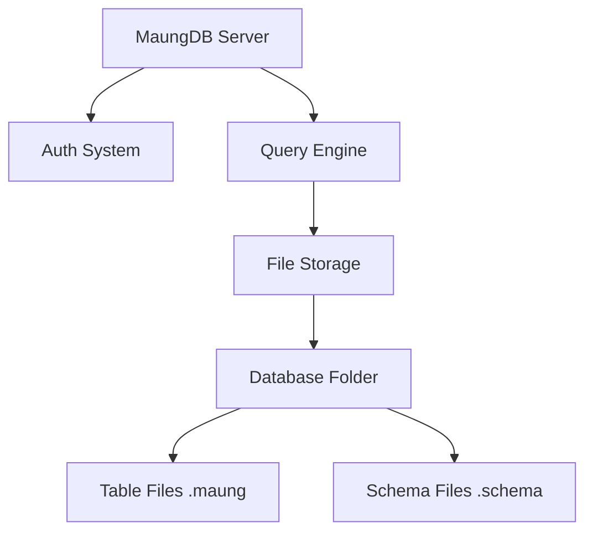

```markdown
# 🐯 MaungDB


**MaungDB** adalah database relasional berbasis file yang ringan, cepat, dan *CLI-first*. Dibangun murni menggunakan Go, MaungDB mengusung kearifan lokal dengan sintaks berbasis Bahasa Sunda (`simpen`, `tingali`, `kandang`) namun tetap powerful dengan fitur *Type System*, *RBAC Security*, dan *HTTP API*.

> *"Database buatan urang, pikeun dunya."*

---

## 🏗️ Arsitektur

MaungDB menggunakan konsep **Multi-Database Design**. Data disimpan secara terstruktur dalam folder sistem (`maung_data`), memastikan isolasi data yang aman.



---

## 🚀 Instalasi

### Cara 1: Install Script (Direkomendasikan)

Jalankan perintah berikut di terminal Linux/Mac Anda:

```bash
chmod +x install.sh
./install.sh

```

### Cara 2: Build Manual

Pastikan Go sudah terinstall.

```bash
git clone [https://github.com/febrd/maungdb.git](https://github.com/febrd/maungdb.git)
cd maungdb
go build -ldflags "-X main.Version=v1.0.0" -o maung ./cmd/maung
sudo mv maung /usr/local/bin/

```

### Inisialisasi Sistem

Setelah install, inisialisasi folder data sistem:

```bash
maung init
# Output: ✅ MaungDB siap Di angge
# Default user: maung / maung (supermaung)

```

---

## 📖 Panduan Penggunaan (User Guide)

MaungDB memiliki sistem role:

1. **supermaung**: Dewa (Bisa create user, database, reset password).
2. **admin**: Manajer (Bisa create schema, read/write data).
3. **user**: Pengguna Biasa (Hanya bisa read/write sesuai izin).

### 1. Login & Autentikasi

Masuk menggunakan kredensial default.

```bash
maung login maung maung
# ✅ login salaku maung (supermaung)

```

### 2. Manajemen User & Database (Supermaung Only)

Membuat user baru dan menetapkan database untuk mereka.

```bash
# Format: createuser <nama> <password> <role>
maung createuser ujang rahasia admin

# Format: setdb <user> <db1,db2>
maung createdb kampus
maung setdb ujang kampus

# Ganti password jika lupa
maung passwd ujang passwordbaru

```

### 3. Manajemen Schema (Admin/Supermaung)

MaungDB **Strict Typed**. Anda harus mendefinisikan kolom dan tipe data (`INT` atau `STRING`) serta hak akses.

```bash
# Gunakan database dulu
maung use kampus

# Format: schema create <tabel> <kol:tipe,kol:tipe> --read=.. --write=..
maung schema create mahasiswa nim:int,nama:string,jurusan:string \
  --read=user,admin,supermaung \
  --write=admin,supermaung

```

### 4. Operasi Data (MaungQL)

#### ➤ Simpen (Insert)

Menyimpan data baru. Tipe data akan divalidasi (misal: kolom `INT` tidak bisa diisi huruf).

```bash
# Format: simpen <table> <val|val|val>
maung simpen mahasiswa 101|Asep|Informatika
maung simpen mahasiswa 102|Euis|Seni

```

#### ➤ Tingali (Select)

Melihat data dengan tampilan tabel yang rapi (*Pretty Output*). Mendukung filtering dengan `dimana` (WHERE) dan logika `DAN` / `ATAU`.

```bash
# Lihat semua data
maung tingali mahasiswa

# Filter sederhana
maung tingali mahasiswa dimana nim = 101

# Filter kompleks (AND/OR Logic)
maung tingali mahasiswa dimana jurusan = Informatika DAN nim > 100

```

**Contoh Output:**

```text
+-----+-------+-------------+
| nim | nama  | jurusan     |
+-----+-------+-------------+
| 101 | febriansah  | Informatika |
| 102 | febri  | Seni        |
+-----+-------+-------------+
2 baris kapanggih

```

---

## 🌐 API Server Mode

MaungDB siap dihubungkan dengan Frontend (React/Vue) atau Mobile Apps. Jalankan mode server untuk membuka REST API. Secara default, server disarankan berjalan di port **7070**.

```bash
maung server 7070
# 🐯 MaungDB Server jalan di port 7070...

```

**Contoh Request:**

```bash
curl -X POST http://localhost:7070/query \
     -d '{"query": "tingali mahasiswa"}'

```

**Contoh Response JSON:**

```json
{
  "success": true,
  "data": {
    "Columns": ["nim", "nama", "jurusan"],
    "Rows": [["101", "febriansah", "Informatika"]]
  }
}

```

---

## 📚 Kamus MaungQL (Syntax Reference)

Berikut adalah *grammar* resmi bahasa query MaungDB.

| Keyword | SQL Equivalent | Contoh Penggunaan |
| --- | --- | --- |
| **`simpen`** | `INSERT INTO` | `simpen users 1 |
| **`tingali`** | `SELECT * FROM` | `tingali users` |
| **`dimana`** | `WHERE` | `tingali users dimana id=1` |
| **`DAN`** | `AND` | `...dimana id=1 DAN status=aktif` |
| **`ATAU`** | `OR` | `...dimana id=1 ATAU id=2` |

**Operator yang didukung:**
`=`, `!=`, `>`, `<`, `>=`, `<=`

**Tipe Data yang didukung:**

* `STRING`: Teks bebas.
* `INT`: Angka bulat (mendukung operasi matematika perbandingan).

---

## 🗺️ Roadmap Status

| Versi | Fitur Utama | Status |
| --- | --- | --- |
| **v0.1** | Core Storage, Auth, CLI Basic | ✅ Selesai |
| **v0.2** | Schema Engine, Permission | ✅ Selesai |
| **v0.3** | MaungQL (WHERE, AND/OR), Type System | ✅ Selesai |
| **v1.0** | API Server, Pretty Output, Installer | ✅ **Rilis Saat Ini** |
| v1.x | Indexing (Cakar), Transaction | ⏳ Coming Soon |

---

## 🤝 Kontribusi

Proyek ini Open Source. Silakan *fork* dan buat *pull request*!
Jangan lupa beri ⭐ bintang jika Anda menyukai kearifan lokal dalam kode ini.

---

**Dibuat dengan ❤️ dan ☕ di Bandung.**
*(c) 2026 MaungDB Team*

```

```