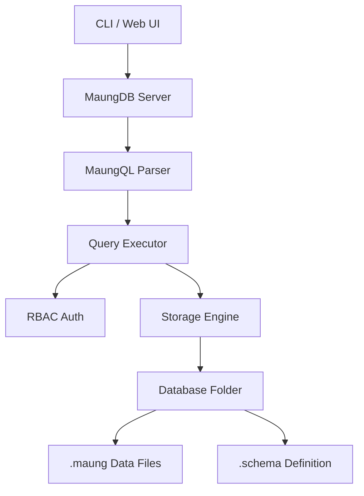

# 🐯 MaungDB


**MaungDB** adalah database relasional berbasis file yang ringan, cepat, dan *CLI-first*. Dibangun murni menggunakan **Go (Golang)**, MaungDB mengusung kearifan lokal dengan sintaks berbasis Bahasa Sunda (`SIMPEN`, `TINGALI`, `OMEAN`) namun tetap powerful dengan fitur *Type System* modern, *RBAC Security*, dan *Web Dashboard UI*.

> *"Database buatan urang, pikeun dunya. (Database buatan kita, untuk dunia)."*

---

## 📸 Tampilan & Demo

### 🎥 Video Demo
*(Silakan klik gambar di bawah untuk memutar video demo)*

[](https://www.youtube.com/watch?v=YOUR_VIDEO_ID)

> *Ganti `YOUR_VIDEO_ID` dengan ID video YouTube demo Anda.*

### 🖼️ Screenshot Dashboard
| **Login Screen** | **Dashboard & Stats** |
|:---:|:---:|
|  |  |

| **Query Console** | **Table Designer** |
|:---:|:---:|
|  |  |

---

## 🏗️ Arsitektur

MaungDB menggunakan konsep **Multi-Database Design**. Data disimpan secara terstruktur dalam folder sistem (`maung_data`), memastikan isolasi data yang aman antar pengguna.



---

## 🚀 Instalasi

### Cara 1: Install Script (Linux/Mac)

Jalankan perintah berikut di terminal Anda untuk instalasi otomatis:

```bash
curl -fsSL [https://raw.githubusercontent.com/febrd/maungdb/main/install.sh](https://raw.githubusercontent.com/febrd/maungdb/main/install.sh) | bash

```

### Cara 2: Build Manual (Semua OS)

Pastikan **Go 1.20+** sudah terinstall.

```bash
# 1. Clone Repository
git clone [https://github.com/febrd/maungdb.git](https://github.com/febrd/maungdb.git)
cd maungdb

# 2. Build Binary
go build -ldflags "-X main.Version=v2.0.0" -o maung ./cmd/maung

# 3. Pindahkan ke PATH (Linux/Mac)
sudo mv maung /usr/local/bin/
# (Windows: Tambahkan folder ke Environment Variables)

```

### ⚡ Inisialisasi Sistem

Sebelum digunakan, inisialisasi folder data sistem (kandang maung):

```bash
maung init
# Output: ✅ MaungDB siap Di angge
# Default user: maung / maung (Role: supermaung)

```

---

## 📖 Panduan Penggunaan (User Guide)

MaungDB memiliki sistem **Role-Based Access Control (RBAC)**:

1. **supermaung**: Dewa (Full Access: Create User, DB, Reset Password).
2. **admin**: Manajer (Create Schema, Read/Write All Data).
3. **user**: Pengguna Biasa (Hanya Read/Write sesuai izin tabel).

### 1. Perintah Dasar (System Commands)

| Perintah | Deskripsi | Contoh |
| --- | --- | --- |
| `maung login <u,p>` | Masuk ke sistem | `maung login maung maung` |
| `maung logout` | Keluar sesi | `maung logout` |
| `maung whoami` | Cek status login | `maung whoami` |
| `maung createuser` | Buat user baru (Supermaung) | `maung createuser ujang 123 admin` |
| `maung listuser` | Lihat daftar user | `maung listuser` |
| `maung passwd` | Ganti password | `maung passwd ujang passwordbaru` |
| `maung createdb` | Buat database baru | `maung createdb kampus` |
| `maung use` | Pilih database aktif | `maung use kampus` |
| `maung setdb` | Beri akses DB ke user | `maung setdb ujang kampus` |

### 2. Manajemen Schema (Table Designer)

MaungDB **Strict Typed**. Anda harus mendefinisikan kolom dan tipe data saat membuat tabel.

**Format CLI:**

```bash
# maung schema create <tabel> <kolom:tipe,kolom:tipe>
maung schema create pegawai id:INT,nama:STRING,kelamin:ENUM(PRIA,WANITA),gaji:FLOAT,masuk:DATE

```

**Tipe Data Didukung:**

* **`INT`**: Angka bulat (contoh: `100`, `-5`).
* **`FLOAT`**: Angka desimal (contoh: `3.14`, `10.5`).
* **`STRING`**: Teks pendek (contoh: `"Asep"`).
* **`TEXT`**: Teks panjang / deskripsi.
* **`BOOL`**: Boolean (contoh: `true`, `false`).
* **`DATE`**: Tanggal format ISO (contoh: `2024-01-30`).
* **`CHAR(n)`**: Karakter panjang tetap (contoh: `CHAR(5)` untuk kode pos).
* **`ENUM(a,b)`**: Pilihan terbatas (contoh: `ENUM(L,P)`).

---

## 🐯 MaungQL v2 (Query Language)

MaungDB menggunakan bahasa query sendiri yang disebut **MaungQL**. Berikut adalah kamus lengkapnya.

### ➤ CRUD Operations

#### 1. SIMPEN (Insert)

Menyimpan data baru. Delimiter menggunakan pipa `|`.

```sql
SIMPEN pegawai 101|Asep|PRIA|5500000|2023-01-10
SIMPEN pegawai 102|Siti|WANITA|6000000|2023-02-20

```

#### 2. TINGALI (Select)

Melihat data. Mendukung filtering, sorting, limiting, dan searching.

```sql
-- Lihat semua data
TINGALI pegawai

-- Filter sederhana
TINGALI pegawai DIMANA kelamin = WANITA

-- Filter logika kompleks (DAN / ATAU)
TINGALI pegawai DIMANA kelamin = PRIA DAN gaji > 5000000

```

#### 3. OMEAN (Update)

Memperbarui data yang sudah ada.

```sql
-- Format: OMEAN <tbl> JADI <col>=<val> DIMANA ...
OMEAN pegawai JADI gaji=9000000 DIMANA id = 101

```

#### 4. MICEUN (Delete)

Menghapus data dari tabel.

```sql
-- Format: MICEUN TI <tbl> DIMANA ...
MICEUN TI pegawai DIMANA id = 102

```

### ➤ Fitur Lanjutan (Advanced Features)

#### 1. RUNTUYKEUN (Sorting / Order By)

Mengurutkan data berdasarkan kolom tertentu.

* `TI_LUHUR`: Descending (Besar ke Kecil).
* `TI_HANDAP`: Ascending (Kecil ke Besar).

```sql
-- Urutkan gaji terbesar
TINGALI pegawai RUNTUYKEUN gaji TI_LUHUR

```

#### 2. SAKADAR & LIWATAN (Limit & Offset)

Membatasi jumlah data untuk pagination.

```sql
-- Ambil 5 data pertama
TINGALI pegawai SAKADAR 5

-- Halaman ke-2 (lewati 5 data awal)
TINGALI pegawai SAKADAR 5 LIWATAN 5

```

#### 3. JIGA (Search / Like)

Pencarian teks (Case-insensitive search).

```sql
-- Cari nama yang mengandung "sep" (misal: Asep, Septian)
TINGALI pegawai DIMANA nama JIGA sep

```

---

## 🌐 Web Server & API

MaungDB dilengkapi dengan **Embedded Web Server** yang menyajikan Dashboard UI dan REST API.

### Menjalankan Server

Secara default berjalan di port **7070**.

```bash
maung server 7070
# Output:
# 🐯 MaungDB Server running
# 🌐 Web UI  : http://localhost:7070
# 🔌 API     : http://localhost:7070/query

```

### Akses Dashboard

Buka browser dan kunjungi: **[http://localhost:7070](https://www.google.com/search?q=http://localhost:7070)**

* Login default: `maung` / `maung`

### Menggunakan API (cURL)

Anda bisa mengintegrasikan MaungDB dengan aplikasi Frontend (React/Vue/Mobile) melalui endpoint `/query`.

**Request:**

```bash
curl -X POST http://localhost:7070/query \
     -H "Content-Type: application/json" \
     -d '{"query": "TINGALI pegawai DIMANA gaji > 5000000"}'

```

**Response:**

```json
{
  "success": true,
  "data": {
    "Columns": ["id", "nama", "kelamin", "gaji", "masuk"],
    "Rows": [
        ["101", "Asep", "PRIA", "5500000", "2023-01-10"]
    ]
  }
}

```

## ⚖️ Perbandingan: MaungQL vs SQL Biasa

Bagi Anda yang sudah terbiasa dengan SQL (seperti MySQL atau PostgreSQL), atau bagi pemula yang baru belajar, berikut adalah tabel perbandingan untuk memahami logika MaungDB:

| Konsep Dasar | SQL Standard (Inggris) | 🐯 MaungQL (Sunda/Lokal) | Arti Harfiah / Filosofi |
| :--- | :--- | :--- | :--- |
| **Melihat Data** | `SELECT * FROM table` | `TINGALI table` | **Tingali** artinya "Lihat". Kita ingin melihat isi data. |
| **Menambah Data** | `INSERT INTO table` | `SIMPEN table` | **Simpen** artinya "Simpan". Kita menyimpan data ke laci/tabel. |
| **Mengubah Data** | `UPDATE table SET ...` | `OMEAN table JADI ...` | **Omean** artinya "Perbaiki" atau "Modifikasi". Data salah? Di-omean (diperbaiki). |
| **Menghapus Data** | `DELETE FROM table` | `MICEUN TI table` | **Miceun** artinya "Buang". Data tidak perlu? Dibuang. |
| **Kondisi** | `WHERE` | `DIMANA` | Menanyakan lokasi data spesifik. |
| **Urutan** | `ORDER BY` | `RUNTUYKEUN` | **Runtuykeun** artinya "Urutkan/Runtunkan". Biar rapi berurutan. |
| **Batas Data** | `LIMIT` | `SAKADAR` | **Sakadar** artinya "Sekadar/Hanya". Ambil sekadarnya saja. |
| **Pencarian** | `LIKE` | `JIGA` | **Jiga** artinya "Mirip/Seperti". Mencari yang mirip-mirip. |

> *"Coding tidak harus selalu pakai Bahasa Inggris. Logika adalah universal."*

---

## 💡 Filosofi & Tujuan (Why MaungDB?)

MaungDB diciptakan bukan untuk menyaingi raksasa seperti Oracle atau PostgreSQL di tingkat enterprise, melainkan untuk **Edukasi** dan **Aksesibilitas**.

### 1. Mengatasi Kendala Bahasa (Language Barrier)
Banyak siswa SD, SMP, hingga SMK di Indonesia yang cerdas secara logika, namun terhambat saat belajar *coding* karena harus menghafal sintaks bahasa Inggris yang asing (`Constraint`, `Foreign Key`, `Execute`).
* **Solusi:** MaungDB menggunakan bahasa ibu (Sunda/Indonesia) yang akrab di telinga, membuat konsep database terasa lebih dekat dan tidak mengintimidasi.

### 2. Memahami Konsep "Under The Hood"
Database modern seringkali terasa seperti "Kotak Ajaib" (Blackbox). Kita install, lalu jalan. Tapi bagaimana cara kerjanya?
* **Solusi:** MaungDB adalah database **File-Based** yang transparan. Siswa bisa membuka folder `maung_data` dan melihat sendiri bagaimana tabel disimpan, bagaimana skema ditulis, dan bagaimana data dipisahkan. Ini sangat baik untuk mahasiswa IT yang ingin belajar cara kerja DBMS.

### 3. Kesederhanaan (Simplicity)
Menginstall database server konvensional membutuhkan konfigurasi port, user root, service daemon, dll yang seringkali membuat pemula menyerah sebelum mulai *coding*.
* **Solusi:** MaungDB adalah single binary. Download -> Jalankan. Tidak ada instalasi service yang rumit. Cocok untuk laptop sekolah dengan spesifikasi rendah.

---

## 🎓 Siapa yang Cocok Menggunakan MaungDB?

* **👶 Siswa SD/SMP:** Yang baru pertama kali mengenal konsep data. Perintah `SIMPEN` dan `TINGALI` jauh lebih mudah dipahami logika dasarnya daripada struktur SQL yang kaku.
* **🏫 Siswa SMK/SMA:** Sebagai jembatan sebelum masuk ke SQL industri. Memahami logika *Query* (CRUD) tanpa pusing dengan sintaks yang rumit.
* **💻 Mahasiswa IT:** Untuk mempelajari *Source Code* bagaimana membuat Database Engine sendiri menggunakan bahasa Go (Golang).
* **🔄 Career Switcher:** Mereka yang ingin terjun ke dunia Data Analyst/Engineer tapi merasa terintimidasi oleh kompleksitas tools modern. MaungDB adalah tempat latihan yang ramah.

---

---

## 🛠️ Tech Stack

* **Bahasa**: Go (Golang) 1.20+
* **Storage**: Flat File (CSV-like with schema validation)
* **Frontend**: HTML5, CSS3 (MaungUI Theme), Vanilla JS
* **Protocol**: HTTP REST API

---

## 🤝 Kontribusi

Proyek ini Open Source dan sangat terbuka untuk kontribusi!

1. Fork repository ini.
2. Buat branch fitur baru (`git checkout -b fitur-anyar`).
3. Commit perubahan (`git commit -m "Nambahkeun fitur X"`).
4. Push ke branch (`git push origin fitur-anyar`).
5. Buka **Pull Request**.

Jangan lupa beri ⭐ **Bintang** jika Anda menyukai kearifan lokal dalam kode ini!

---

**Dibuat dengan ❤️ dan ☕ di Bandung.**
*(c) 2026 MaungDB Team*


