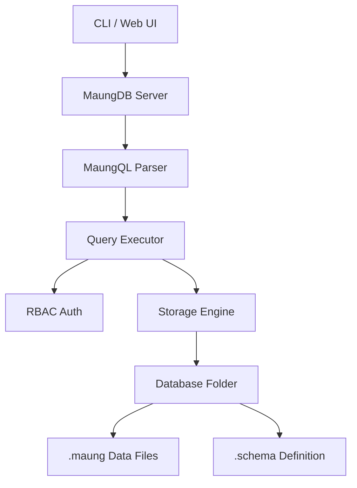

# 🐯 MaungDB

**MaungDB** is a lightweight, fast, and *CLI-first* file-based relational database. Built purely using **Go (Golang)**, MaungDB embraces local wisdom with syntax based on the Sundanese language (`SIMPEN`, `TINGALI`, `OMEAN`) yet remains powerful with modern *Type System*, *RBAC Security*, and a *Web Dashboard UI*.

> *"Database buatan urang, pikeun dunya. (Database made by us, for the world)."*

---

## Screenshots & Demo

### Demo Video

*(Please click the image below to play the demo video)*

[](https://www.youtube.com/watch?v=J4IThAnQjWo)


### Dashboard Screenshots

| **Login Screen** | **Dashboard & Stats** |
| --- | --- |
|  |  |

| **Query Console** | **Table Designer** |
| --- | --- |
|  |  |

---

## Architecture

MaungDB uses a **Multi-Database Design** concept. Data is stored structurally within the system folder (`maung_data`), ensuring secure data isolation between users.



---

## Installation

### Method 1: Install Script (Linux/Mac)

Run the following command in your terminal for automatic installation:

```bash
curl -fsSL [https://raw.githubusercontent.com/febrd/maungdb/main/install.sh](https://raw.githubusercontent.com/febrd/maungdb/main/install.sh) | bash


```

### Method 2: Manual Build (All OS)

Ensure **Go 1.20+** is installed.

```bash
# 1. Clone Repository
git clone [https://github.com/febrd/maungdb.git](https://github.com/febrd/maungdb.git)
cd maungdb

# 2. Build Binary
go build -ldflags "-X main.Version=v2.0.0" -o maung ./cmd/maung

# 3. Move to PATH (Linux/Mac)
sudo mv maung /usr/local/bin/
# (Windows: Add folder to Environment Variables)


```

### System Initialization

Before use, initialize the system data folder (maung cage):

```bash
maung init
# Output: ✅ MaungDB siap Di angge (MaungDB is ready to use)
# Default user: maung / maung (Role: supermaung)


```

---

## User Guide

MaungDB features a **Role-Based Access Control (RBAC)** system:

1. **supermaung**: God Mode (Full Access: Create User, DB, Reset Password).
2. **admin**: Manager (Create Schema, Read/Write All Data).
3. **user**: Regular User (Only Read/Write according to table permissions).

### 1. Basic Commands (System Commands)

| Command | Description | Example |
| --- | --- | --- |
| `maung login <u,p>` | Log in to the system | `maung login maung maung` |
| `maung logout` | Log out of session | `maung logout` |
| `maung whoami` | Check login status | `maung whoami` |
| `maung createuser` | Create new user (Supermaung) | `maung createuser ujang 123 admin` |
| `maung listuser` | View user list | `maung listuser` |
| `maung passwd` | Change password | `maung passwd ujang newpassword` |
| `maung createdb` | Create new database | `maung createdb campus` |
| `maung use` | Select active database | `maung use campus` |
| `maung setdb` | Grant DB access to user | `maung setdb ujang campus` |

### 2. Schema Management (Table Designer)

MaungDB is **Strict Typed**. You must define columns and data types when creating a table.

**CLI Format:**

```bash
# maung schema create <table> <column:type,column:type>
maung schema create pegawai id:INT,nama:STRING,kelamin:ENUM(PRIA,WANITA),gaji:FLOAT,masuk:DATE


```

**Supported Data Types:**

* **`INT`**: Integer (e.g., `100`, `-5`).
* **`FLOAT`**: Decimal number (e.g., `3.14`, `10.5`).
* **`STRING`**: Short text (e.g., `"Asep"`).
* **`TEXT`**: Long text / description.
* **`BOOL`**: Boolean (e.g., `true`, `false`).
* **`DATE`**: Date in ISO format (e.g., `2024-01-30`).
* **`CHAR(n)`**: Fixed-length characters (e.g., `CHAR(5)` for postal codes).
* **`ENUM(a,b)`**: Limited choices (e.g., `ENUM(L,P)`).

---

## MaungQL v2 (Query Language)

MaungDB uses its own query language called **MaungQL**. Below is the complete dictionary.

### ➤ CRUD Operations

#### 1. SIMPEN (Insert)

Save new data. Uses the pipe `|` delimiter.

```sql
SIMPEN pegawai 101|Asep|PRIA|5500000|2023-01-10
SIMPEN pegawai 102|Siti|WANITA|6000000|2023-02-20


```

#### 2. TINGALI (Select)

View data. Supports filtering, sorting, limiting, and searching.

```sql
-- View all data
TINGALI pegawai

-- Simple filter
TINGALI pegawai DIMANA kelamin = WANITA

-- Complex logic filter (AND / OR)
TINGALI pegawai DIMANA kelamin = PRIA DAN gaji > 5000000


```

#### 3. OMEAN (Update)

Update existing data.

```sql
-- Format: OMEAN <tbl> JADI <col>=<val> DIMANA ...
OMEAN pegawai JADI gaji=9000000 DIMANA id = 101


```

#### 4. MICEUN (Delete)

Delete data from a table.

```sql
-- Format: MICEUN TI <tbl> DIMANA ...
MICEUN TI pegawai DIMANA id = 102


```

### ➤ Advanced Features

#### 1. RUNTUYKEUN (Sorting / Order By)

Sort data based on a specific column.

* `TI_LUHUR`: Descending (Large to Small).
* `TI_HANDAP`: Ascending (Small to Large).

```sql
-- Sort by largest salary
TINGALI pegawai RUNTUYKEUN gaji TI_LUHUR


```

#### 2. SAKADAR & LIWATAN (Limit & Offset)

Limit the amount of data for pagination.

```sql
-- Get first 5 records
TINGALI pegawai SAKADAR 5

-- 2nd Page (skip first 5 records)
TINGALI pegawai SAKADAR 5 LIWATAN 5


```

#### 3. JIGA (Search / Like)

Text search (Case-insensitive search).

```sql
-- Search for names containing "sep" (e.g., Asep, Septian)
TINGALI pegawai DIMANA nama JIGA sep


```

---

## Web Server & API

MaungDB comes with an **Embedded Web Server** that serves a Dashboard UI and REST API.

### Running the Server

Runs on port **7070** by default.

```bash
maung server 7070
# Output:
# 🐯 MaungDB Server running
# 🌐 Web UI  : http://localhost:7070
# 🔌 API     : http://localhost:7070/query


```

### Access Dashboard

Open your browser and visit: **[http://localhost:7070](https://www.google.com/search?q=http://localhost:7070)**

* Default login: `maung` / `maung`

### Using the API (cURL)

You can integrate MaungDB with Frontend applications (React/Vue/Mobile) via the `/query` endpoint.

**Request:**

```bash
curl -X POST http://localhost:7070/query \
     -H "Content-Type: application/json" \
     -d '{"query": "TINGALI pegawai DIMANA gaji > 5000000"}'


```

**Response:**

```json
{
  "success": true,
  "data": {
    "Columns": ["id", "nama", "kelamin", "gaji", "masuk"],
    "Rows": [
        ["101", "Asep", "PRIA", "5500000", "2023-01-10"]
    ]
  }
}


```

## ⚖️ Comparison: MaungQL vs Standard SQL

For those already familiar with SQL (like MySQL or PostgreSQL), or for beginners just starting out, here is a comparison table to understand MaungDB logic:

| Basic Concept | SQL Standard (English) | 🐯 MaungQL (Sundanese/Local) | Literal Meaning / Philosophy |
| --- | --- | --- | --- |
| **View Data** | `SELECT * FROM table` | `TINGALI table` | **Tingali** means "Look/See". We want to see the content of the data. |
| **Add Data** | `INSERT INTO table` | `SIMPEN table` | **Simpen** means "Save/Keep". We store data into a drawer/table. |
| **Modify Data** | `UPDATE table SET ...` | `OMEAN table JADI ...` | **Omean** means "Fix" or "Modify". Data is wrong? It gets *di-omean* (fixed). |
| **Delete Data** | `DELETE FROM table` | `MICEUN TI table` | **Miceun** means "Throw away". Data is not needed? Throw it away. |
| **Condition** | `WHERE` | `DIMANA` | Asking for the location of specific data (Where). |
| **Sequence** | `ORDER BY` | `RUNTUYKEUN` | **Runtuykeun** means "Sort/Sequence". So it's neatly ordered. |
| **Data Limit** | `LIMIT` | `SAKADAR` | **Sakadar** means "Just/Only". Take just enough. |
| **Search** | `LIKE` | `JIGA` | **Jiga** means "Like/Similar". Looking for something similar. |

> *"Coding doesn't always have to use English. Logic is universal."*

---

## Philosophy & Goals (Why MaungDB?)

MaungDB was created not to compete with giants like Oracle or PostgreSQL at the enterprise level, but for **Education** and **Accessibility**.

### 1. Overcoming Language Barriers

Many smart elementary, junior high, and vocational students in Indonesia are logically brilliant but are hindered when learning *coding* because they have to memorize foreign English syntax (`Constraint`, `Foreign Key`, `Execute`).

* **Solution:** MaungDB uses a mother tongue (Sundanese/Indonesian) that is familiar to the ear, making database concepts feel closer and less intimidating.

### 2. Understanding Concepts "Under The Hood"

Modern databases often feel like a "Magic Box" (Blackbox). We install, then it runs. But how does it work?

* **Solution:** MaungDB is a **File Based** database that is transparent. Students can open the `maung_data` folder and see for themselves how tables are stored, how schemas are written, and how data is separated. This is excellent for IT students who want to learn how a DBMS works.

### 3. Simplicity

Installing a conventional database server requires configuring ports, root users, service daemons, etc., which often makes beginners give up before they start *coding*.

* **Solution:** MaungDB is a single binary. Download -> Run. No complicated service installation. Suitable for school laptops with low specifications.

---

## Who is MaungDB Suitable For?

* ** - Elementary/Middle School Students:** Those getting to know data concepts for the first time. Commands `SIMPEN` and `TINGALI` are much easier to understand logically than rigid SQL structures.
* ** - Vocational/High School Students:** As a bridge before entering industrial SQL. Understanding *Query* logic (CRUD) without the headache of complex syntax.
* ** - IT Students:** To study the *Source Code* of how to build a Database Engine yourself using the Go (Golang) language.
* ** - Career Switchers:** Those who want to dive into the world of Data Analyst/Engineer but feel intimidated by the complexity of modern tools. MaungDB is a friendly practice ground.

---

---

## Tech Stack

* **Language**: Go (Golang) 1.20+
* **Storage**: Flat File (CSV-like with schema validation)
* **Frontend**: HTML5, CSS3 (MaungUI Theme), Vanilla JS
* **Protocol**: HTTP REST API

---

## Contribution

This project is Open Source and very open to contributions!

1. Fork this repository.
2. Create a new feature branch (`git checkout -b new-feature`).
3. Commit your changes (`git commit -m "Add feature X"`).
4. Push to the branch (`git push origin new-feature`).
5. Open a **Pull Request**.

Don't forget to give a ⭐ **Star** if you like the local wisdom in this code!

---

**Made with ❤️ and ☕ in Bandung.**
*(c) 2026 MaungDB Team*
